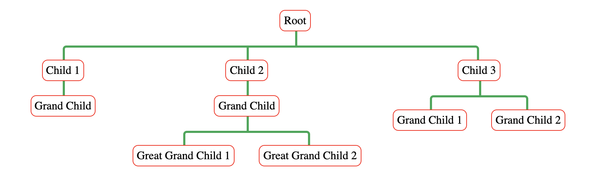

# react-organizational-hierarchy

> Simple react hierarchy tree - any React children accepted for nodes

based on react-organizational-chart but replaces @emotion/css with css modules

## Install

```bash
npm install --save react-organizational-hierarchy
```

## Usage

```jsx
import React from 'react';
import { Tree, TreeNode } from 'react-organizational-hierarchy';

const ExampleTree = () => (
  <Tree label={<div>Root</div>}>
    <TreeNode label={<div>Child 1</div>}>
      <TreeNode label={<div>Grand Child</div>} />
    </TreeNode>
  </Tree>
);
```

## Examples

### Styled tree



```jsx
const StyledNode = ({children}) => (
  <div
    style={{
      padding: '5px',
      borderRadius: '8px',
      display: 'inline-block',
      border: '1px solid #ff0000',
    }}
  >
      {children}
  </div>
)

const StyledTreeExample = () => (
  <Tree
    lineWidth={'2px'}
    lineColor={'green'}
    lineBorderRadius={'10px'}
    label={<StyledNode>Root</StyledNode>}
  >
    <TreeNode label={<StyledNode>Child 1</StyledNode>}>
      <TreeNode label={<StyledNode>Grand Child</StyledNode>} />
    </TreeNode>
    <TreeNode label={<StyledNode>Child 2</StyledNode>}>
      <TreeNode label={<StyledNode>Grand Child</StyledNode>}>
        <TreeNode label={<StyledNode>Great Grand Child 1</StyledNode>} />
        <TreeNode label={<StyledNode>Great Grand Child 2</StyledNode>} />
      </TreeNode>
    </TreeNode>
    <TreeNode label={<StyledNode>Child 3</StyledNode>}>
      <TreeNode label={<StyledNode>Grand Child 1</StyledNode>} />
      <TreeNode label={<StyledNode>Grand Child 2</StyledNode>} />
    </TreeNode>
  </Tree>
);
```

Interactive examples can be found [here](https://hamdiwanis.github.io/react-organizational-hierarchy/)

## Components

### `Tree` - The root of the tree

Accepts the following props:

- **label:** _**\(required\)**_ Any react `Node`
- **children:** _**\(required\)**_ Any number of `<TreeNode>`
- **lineHeight:** _\(default 20px\)_ The height of the Path as a [css length](https://developer.mozilla.org/en-US/docs/Web/CSS/length)
- **lineWidth:** _\(default 1px\)_ The width of the Path as a [css length](https://developer.mozilla.org/en-US/docs/Web/CSS/length)
- **lineColor:** _\(default black\)_ The color of the Path as a [css color](https://developer.mozilla.org/en-US/docs/Web/CSS/color)
- **lineStyle:** _\(default solid\)_ The line style as a [css line-style](https://developer.mozilla.org/en-US/docs/Web/CSS/border-style#values)
- **lineBorderRadius:** _\(default 5px\)_ The border radius of the Path as a [css border-radius](https://developer.mozilla.org/en-US/docs/Web/CSS/border-radius)
- **nodePadding:** _\(default 5px\)_ The left and right padding of every `<TreeNode>` as a [css length](https://developer.mozilla.org/en-US/docs/Web/CSS/length)

### `TreeNode` - A node in the tree

- **label:** _**\(required\)**_ Any react `Node`
- **children:** _**\(required\)**_ Any number of `<TreeNode>`

## License

MIT ©
